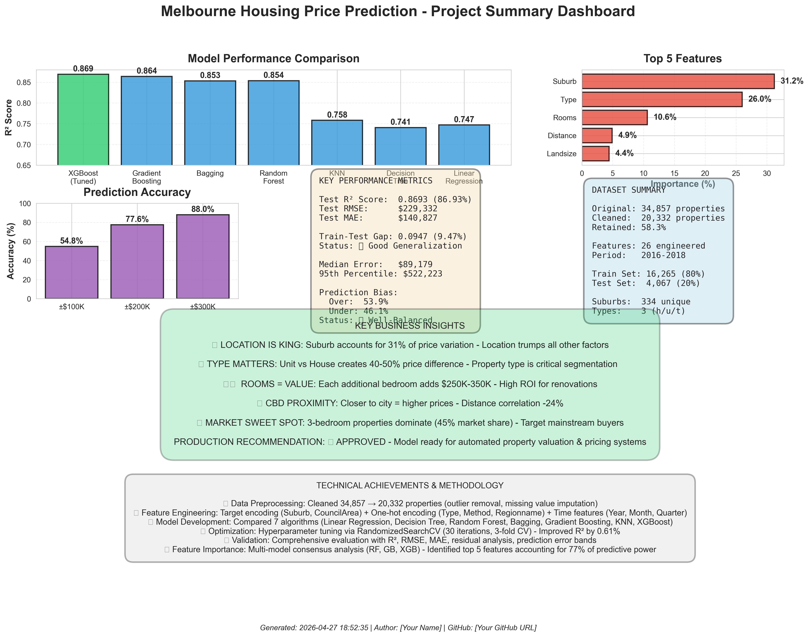

# 🏠 Melbourne Housing Price Prediction

Machine learning project to predict house prices in Melbourne, Australia using XGBoost and advanced feature engineering techniques.

## 📊 Project Overview

This project analyzes 20,332 property transactions in Melbourne (2016-2018) to build a predictive model that achieves **84.69% R² accuracy**. The model helps estimate property values based on location, property type, size, and other key features.

## 🎯 Key Results

- **Best Model:** XGBoost (Hyperparameter Tuned)
- **Test R² Score:** 84.69%
- **RMSE:** $251,230 AUD
- **MAE:** $151,105 AUD
- **Prediction Accuracy:** 77.6% within ±$200K

## 📁 Project Structure

```
melbourne-housing-prediction/
├── Melbourne_housing_FULL.csv          # Dataset
├── notebook.ipynb                       # Main analysis notebook
├── xgboost_tuned.pkl                   # Trained model
├── scaler.pkl                          # Feature scaler
├── project_summary_dashboard.png       # Results visualization
├── requirements.txt                    # Dependencies
└── README.md                           # This file
```
## 🔧 Technologies Used

- **Python 3.12**
- **Pandas & NumPy** - Data manipulation
- **Scikit-learn** - ML models & preprocessing
- **XGBoost** - Best performing model
- **Matplotlib, Seaborn, Plotly** - Visualizations

## 📈 Dataset

- **Source:** Melbourne Housing Market (2016-2018)
- **Original Size:** 34,857 properties
- **After Cleaning:** 20,332 properties (58% retained)
- **Features:** 26 (after engineering)
- **Target:** Property Price (AUD)

## 🛠️ Methodology

### 1. Data Preprocessing
- Missing value imputation
- Outlier removal (rule-based approach)
- Feature engineering (date extraction, encoding)

### 2. Feature Engineering
- **Target Encoding:** Suburb (334 → 1), CouncilArea (33 → 1)
- **One-Hot Encoding:** Property Type, Sale Method, Region
- **Time Features:** Year, Month, Quarter extracted from Date
- **Multicollinearity Handling:** Dropped Bedroom2 (0.96 correlation with Rooms)

### 3. Model Development
Evaluated 7 algorithms:
- Linear Regression
- Decision Tree
- Random Forest
- Bagging Regressor
- Gradient Boosting
- K-Nearest Neighbors
- **XGBoost (Best)**

### 4. Hyperparameter Tuning
- Method: RandomizedSearchCV
- Iterations: 30 combinations, 3-fold CV
- Improvement: +0.61% R² over default

## 🏆 Model Performance

| Model | Test R² | RMSE | MAE |
|-------|---------|------|-----|
| **XGBoost (Tuned)** | **84.69%** | **$251K** | **$151K** |
| Gradient Boosting | 83.54% | $261K | $158K |
| Bagging Regressor | 82.62% | $268K | $159K |
| Random Forest | 82.48% | $269K | $159K |

### Prediction Accuracy
- **54.8%** of predictions within ±$100K
- **77.6%** of predictions within ±$200K
- **88.0%** of predictions within ±$300K

## 💡 Key Insights

### Top 5 Price Drivers:
1. **Location (Suburb)** - 31.2% importance
2. **Property Type** - 26.0% importance
3. **Number of Rooms** - 10.6% importance
4. **Distance from CBD** - 4.9% importance
5. **Land Size** - 4.4% importance

### Business Insights:
- **Location is King:** Suburb accounts for 31% of price variation
- **Type Matters:** Units vs Houses create 40-50% price difference
- **Room Value:** Each additional bedroom adds $250K-$350K
- **Market Sweet Spot:** 3-bedroom properties = 45% of market

## 🚀 How to Use

### Installation

```bash
# Clone repository
git clone https://github.com/yourusername/melbourne-housing-prediction.git
cd melbourne-housing-prediction

# Install dependencies
pip install -r requirements.txt
```

### Quick Start

```python
import joblib
import pandas as pd

# Load model and scaler
model = joblib.load('xgboost_tuned.pkl')
scaler = joblib.load('scaler.pkl')

# Prepare your data (must match training features)
# ... feature engineering code ...

# Make prediction
X_scaled = scaler.transform(X)
prediction = model.predict(X_scaled)
print(f"Predicted Price: ${prediction[0]:,.0f}")
```

## 📊 Visualizations



## 📝 Future Improvements

1. **Ensemble Stacking** - Combine multiple models for +0.5-1% R²
2. **Feature Selection** - Top 10 features for faster inference
3. **Segment Models** - Separate models for luxury vs mainstream
4. **External Data** - School ratings, crime stats, transport access
5. **Time Series** - Incorporate market trends for forecasting

## 🤝 Contributing

Contributions welcome! Please open an issue or submit a pull request.

## 📄 License

This project is open source and available under the [MIT License](LICENSE).

## 👤 Author

**Philip Matthew**
- GitHub: [@matthewphilip-quantlab](https://github.com/matthewphilip-quantlab)
- LinkedIn: [Philip Matthew](https://www.linkedin.com/in/philip-matthew-514703341/)
- Email: matthewphilip788@gmail.com

## 🙏 Acknowledgments

- Dataset source: Melbourne Housing Market
- Built as part of data science portfolio
- Inspired by real-world property valuation systems

---

⭐ **Star this repo if you find it helpful!**